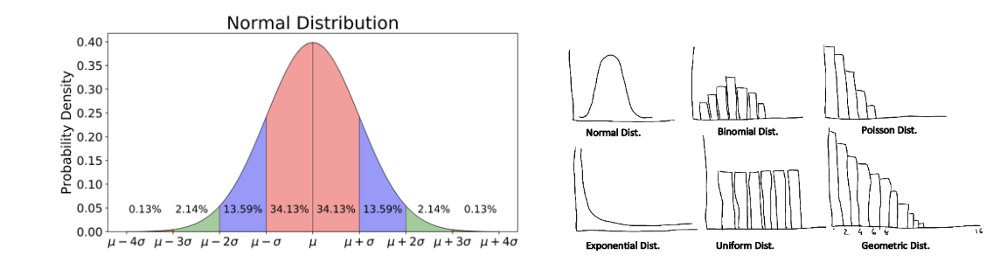

# 🎲 Monte Carlo Simulation – An Overview

In the simplest sense, a **Monte Carlo simulation** is a computational algorithm that uses **repeated random sampling** to find possible outcomes in a system of **uncertain events**.

---

## 🧠 Procedure

1. **Define your problem statement**  
Define your problem statement, as Monte Carlo algorithms can be used in various modeling situations 

2. **Define your potential range of outcomes**  
Define your potential range of outcomes (the upper bounds, lower bound, coefficients)  

3. **Define your “chance” (Probability Distribution)**  
Define your “chance”, which is your distribution probability (uniform, normal, etc.) 

4. **Run your simulation repeatedly**  
Run your simulation systematically, thousands or even millions of times. Each time mapping which outcome had occurred. Monte Carlo derives accuracy from the Law of Large Numbers, i.e. the more trials and simulations run the more accurate the results.  

5. **Aggregate and analyze your results**  
Aggregate your range of outcomes then plot/analyze your results! Optionally: Refine your hypothesis, dataset, and repeat. 
